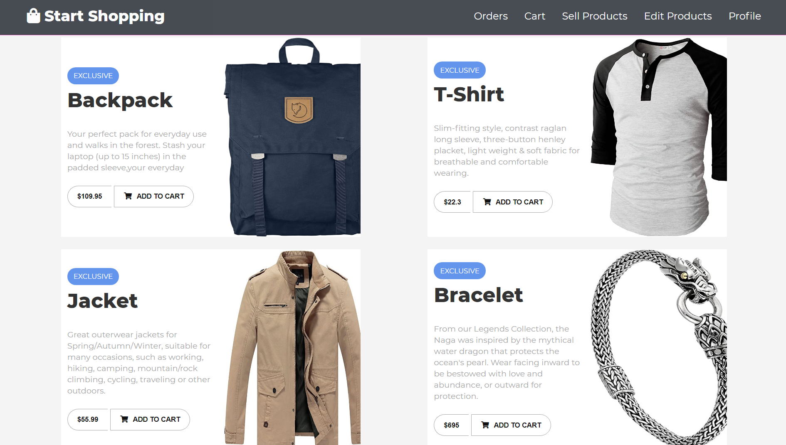
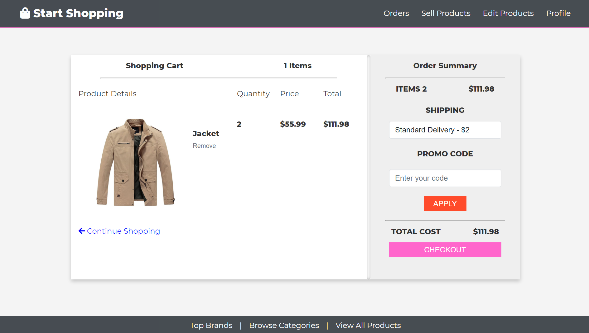

# 🛒 E-COMMERCE Website using (MongoDB, Express, Node, Passport)
[](https://github.com/ritiksingla/Shopping-Site/blob/master/LICENSE)  

## Run Locally
1. Clone repository:
	```bash
	$ git clone https://github.com/ritiksingla/Shopping-Site.git
	```
2. Change directory to project 
	```bash
	$ cd Shopping-Site
	```
3. Install dependencies
	```bash
	$ npm install
	```
4. Set up configuration variables by creating .env file that includes:
	- PORT
	```
	PORT = 5000
	```

	- MongoDB_URI available on [mongodb.com](https://account.mongodb.com/account/login) to connect to mongoDB database
	```
	MONGODB_URI = mongodb+srv://<username>:<password>@cluster0.igv8h.mongodb.net/<dbname>?retryWrites=true&w=majority
	```

	- SESSION_SECRET which allows express-session to use it to encrypt the sessionId
	```
	SESSION_SECRET = some_random_string
	```

	- CLOUDINARY variables available on [cloudinary.com](https://cloudinary.com) to load cloud based images
	```
	CLOUDINARY_CLOUD_NAME
	CLOUDINARY_API_KEY
	CLOUDINARY_API_SECRET
	```

5. Run Server
	```bash
	$ npm start
	```

## Screenshots

### Home Page


### Login and Registration


### Dashboard


### Cart


### Order History


### Add and Edit Product
